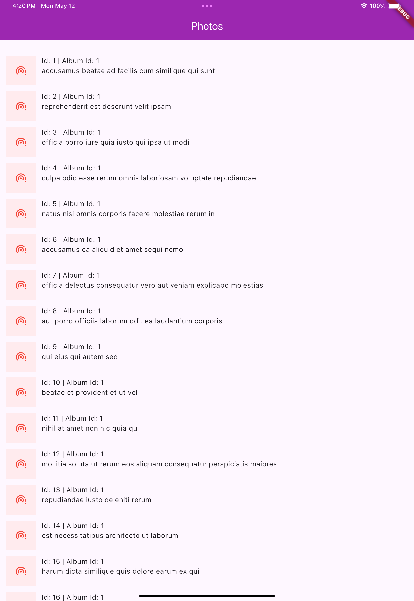
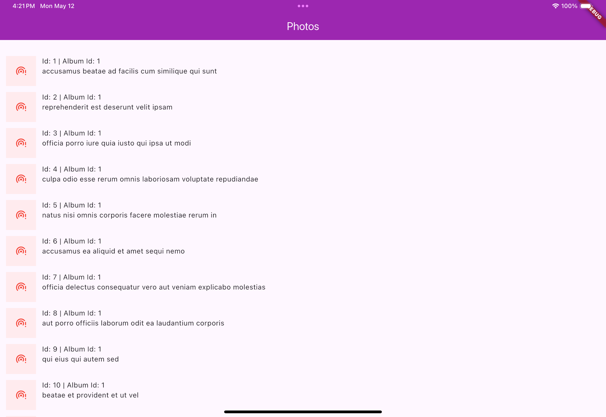

# Photo Gallery App

A Flutter application that displays a list of photos with their details.

## Prerequisites

- Flutter SDK (latest stable version)
- Dart SDK (latest stable version)
- An IDE (VS Code, Android Studio, etc.)

## Installation

1. Clone the repository:

## List of Third party packages used
- `flutter_bloc`: State management solution
- `freezed_annotation`: Code generation for data classes and unions
- `get_it`: Dependency injection
- `cached_network_image`: Loading and caching network images
- `dio`: Network calling
- `retrofit`: Rest API generating

## Screenshots
Portrait Mode: 

Landscape Mode:
